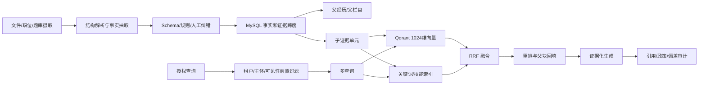

# 40 个 RAG、Agent 协作与 Text-to-SQL 开源项目全量设计汇编

> 研究基线：2026-08-14  
> 仓库数量：RAG 20 个、Agent 协作/写作 10 个、Text-to-SQL 10 个  
> 源码获取：按 `research/REPOSITORY_MANIFEST.md` 中的 GitHub 地址和锁定提交自行克隆  
> 项目内目录联接：`research/source-code`  
> 目的：将此前逐仓库研究整理成一份可连续阅读的设计汇编。每个项目均给出 STAR 背景、执行流程、核心设计、工程难点、重要性和 SmileBoss 采用决策。提交号和 GitHub 地址以 `research/REPOSITORY_MANIFEST.md` 为准。

## 1. 阅读和评分方法

### 1.1 “STAR”在本文中的含义

- **S—Situation**：项目试图解决什么真实问题，为什么简单做法不够；
- **T—Task**：项目必须完成的技术任务和质量目标；
- **A—Action**：源码中实际采用的组件、数据结构和执行步骤；
- **R—Result**：形成了什么能力、仍有哪些残余风险。

### 1.2 难点等级

| 等级 | 含义 | SmileBoss 处理方式 |
|---|---|---|
| P0 | 安全、权限、事实正确性、人工责任边界 | 上线前必须完成，失败时默认拒绝 |
| P1 | 核心质量、可恢复性、召回和执行正确性 | 主流程必须设计并持续评估 |
| P2 | 规模、运营效率、体验和成本优化 | 有真实数据后按瓶颈实施 |
| P3 | 高级能力或研究型增强 | 不阻塞第一阶段上线 |

### 1.3 选型总原则

本项目不把 40 套平台全部引入。采用方式是：

```text
Hiring Agent 的结构化证据
+ Resume Screening 的 Multi-query/RRF/Small-to-big
+ AWS Interview Assistant 的原子题目与 Rubric
+ Onyx 的 ACL 前置过滤
+ Haystack 的分阶段评估
+ LangGraph/MAF 的状态、检查点和 HITL
+ MetaGPT/STORM 的结构化写作交接
+ WrenAI 的语义层
+ Vanna/Dataherald 的规则和 Golden SQL RAG
+ CHESS 的 IR/SS/CG/UT
+ IBM Toolkit 的执行评估门禁
```

MySQL 继续作为事实源；Redis 是队列、锁和短期状态；Qdrant 是可重建检索层；模型永远不直接获得招聘最终决定权和数据库写权限。

---

# 第一部分：20 个 RAG 项目

## 2. Hiring Agent：简历结构化证据与公平评分

- GitHub：<https://github.com/fatmakahveci/hiring-agent>
- 锁定提交：`70fd3ea9aa74`
- 本地源码：`research/source-code/rag/01-hiring-agent`
- 详细底稿：[01-hiring-agent.md](../research/reports/rag/01-hiring-agent.md)

**S/T：** 原始简历版式不稳定，技能散落在项目、经历和简介中。全文向量相似度无法回答“在哪个项目使用、承担什么职责、结果是什么”。任务是把 PDF 转成可验证事实，保留中间产物并形成公平、可解释的岗位评分。

**完整流程：** PDF 接收与哈希 → 结构保留的 Markdown → 栏目识别 → 每栏目独立 Prompt/Schema 抽取 → 类型和必填校验 → 合并 Candidate Profile → 可选公开资料补强 → 按岗位维度匹配证据 → 脱敏与公平性检查 → 输出事实、证据、未知项和分数。

**核心设计：** 分栏目而不是整份简历一次生成；Pydantic/Schema 约束中间 JSON；字段到原文的映射；外部公开事实与候选人声明分开；分维度评分必须引用证据。

**难点和重要性：**

- P0：事实与推断分离，否则错误会污染推荐、面试和报告；
- P0：简历中的隐藏文本和提示注入不能取得工具权限；
- P0：姓名、年龄、性别等不得参与岗位评分；
- P1：双栏、扫描件和复杂表格仍需 OCR/VLM 和人工纠错；
- P1：模型评分需要固定 rubric 和人工校准。

**SmileBoss 决策：** 直接采用栏目级解析、证据跨度、中间结果版本和脱敏原则；外部资料补强必须授权；不采用“LLM 单分数自动淘汰”。

## 3. Resume Screening RAG：Multi-query、RRF 与 Small-to-Big

- GitHub：<https://github.com/RanjitKumar48/Resume-Screening-RAG-Pipeline>
- 锁定提交：`7ebf3e6ca72c`
- 本地源码：`research/source-code/rag/02-resume-screening-rag`
- 详细底稿：[02-resume-screening-rag.md](../research/reports/rag/02-resume-screening-rag.md)

**S/T：** 单一问题表达会漏掉同义技能和相关经历；大块上下文完整但召回不准，小块召回准却缺语境。任务是提高简历召回率并兼顾证据完整性。

**完整流程：** 岗位要求结构化 → 生成技能、职责、成果、职级等多个查询 → 每个查询分别做 dense/keyword 检索 → 结果按 RRF 融合 → 同一父经历聚合去重 → 回填父块 → 精排 → 输出候选、证据、缺口和待确认问题。

**核心设计：** RRF 不要求不同检索器分数同量纲；Small-to-Big 使用子块命中和父块回填；同一父块限制贡献数，防止一段简历占满结果。

**难点和重要性：**

- P1：多查询可能放大噪声，必须限制查询数和意图范围；
- P1：父子块 ID、版本和删除传播必须一致；
- P0：租户与授权过滤必须在召回前执行；
- P1：RRF、top-k 和重排阈值必须通过金标集评估。

**SmileBoss 决策：** 作为简历—职位匹配 RAG 的第一版核心；使用 Qdrant dense + 应用层关键词/技能召回 + RRF；先检索证据，再做岗位聚合。

## 4. AWS Interview Assistant：面试题原子知识对象

- GitHub：<https://github.com/aws-samples/sample-hr-assistant-with-rag>
- 锁定提交：`46911edb0044`
- 本地源码：`research/source-code/rag/03-aws-interview-assistant`
- 详细底稿：[03-aws-interview-assistant.md](../research/reports/rag/03-aws-interview-assistant.md)

**S/T：** 如果把题干、评分标准和面试官说明拆成普通文本块，检索后容易只拿到其中一部分。任务是让一道题成为不可分割、可版本、可过滤的知识对象。

**完整流程：** 题库导入 → 规范化题目对象 → 生成 embedding → 按岗位族/技能/难度/语言/合规标签过滤 → 向量召回 → 完整题目对象回填 → 生成或轻量改写问题 → 保存题目版本和使用记录。

**核心设计：** 题干、rubric、期待证据、允许追问、难度、时间、岗位族和合规标签作为一个对象；元数据过滤先于向量相似度；问题使用记录防重复。

**难点和重要性：**

- P0：题目不能涉及敏感属性或与岗位无关的问题；
- P1：题目难度和岗位职级需要人工校准；
- P1：原子对象不能被字符切块破坏；
- P1：题目版本变化后，历史面试必须仍能还原旧 rubric。

**SmileBoss 决策：** 面试 v2 直接采用原子题库模型；当前固定问题将逐步迁移到版本化 Question/Rubric 对象。

## 5. SkillSyncer：脱敏、经历级向量与两阶段比较

- GitHub：<https://github.com/Mightype/Multi-Agent-Resume-Screening>
- 锁定提交：`9e80ae137db6`
- 本地源码：`research/source-code/rag/04-skillsyncer`
- 详细底稿：[04-skillsyncer.md](../research/reports/rag/04-skillsyncer.md)

**S/T：** 整份简历向量会稀释最强经历，直接比较又可能把姓名和联系方式引入模型。任务是先脱敏，再按经历进行检索和精细比较。

**完整流程：** 简历解析 → PII 脱敏 → 经历/项目切分 → 各经历向量化 → 岗位要求向量化 → 第一阶段粗召回 → 第二阶段逐要求对齐 → 输出匹配、缺口和证据 → 人工复核。

**核心设计：** 经历级而非文档级 embedding；身份数据和岗位事实分离；粗召回与精排分层；不把相似度直接解释为胜任力。

**难点和重要性：** P0 脱敏要防止间接身份泄露；P1 经历边界错误会破坏召回；P1 技能同名不同义需要 taxonomy；P0 结果只能辅助而不能自动淘汰。

**SmileBoss 决策：** 简历向量点以“经历/项目/成果证据”为主要粒度，PII 不写 Qdrant payload。

## 6. Hiring Agent Platform：LangGraph + pgvector 分阶段岗位推荐

- GitHub：<https://github.com/alirezadir/hiring-agent>
- 锁定提交：`cea636574cc3`
- 本地源码：`research/source-code/rag/05-hiring-agent-platform`
- 详细底稿：[05-hiring-agent-platform.md](../research/reports/rag/05-hiring-agent-platform.md)

**S/T：** 推荐从解析到召回、评分、解释包含多个阶段，单函数失败时难定位。任务是用状态图显式表达每个步骤和中间状态。

**完整流程：** 接收候选输入 → 结构化画像 → 向量召回职位 → 规则过滤 → LLM/规则精排 → 生成解释 → 状态图保存每阶段结果 → 输出推荐列表。

**核心设计：** LangGraph 状态承载输入、候选、评分和错误；节点职责小；数据库向量召回与应用编排分开；可观察每阶段产物。

**难点和重要性：** P1 状态 Schema 需要稳定；P1 节点失败和重试不能产生重复推荐；P0 租户过滤不能交给模型；P2 pgvector 路线与 Qdrant 路线需避免双份事实源。

**SmileBoss 决策：** 借鉴阶段化工作流，不迁移到 pgvector；保留 MySQL + Qdrant，推荐 run 保存阶段结果。

## 7. Skillspace：双塔匹配、技能缺口与离线评估

- GitHub：<https://github.com/DmitriiKovalev/Skillspace>
- 锁定提交：`f46f5e6badf6`
- 本地源码：`research/source-code/rag/06-skillspace`
- 详细底稿：[06-skillspace.md](../research/reports/rag/06-skillspace.md)

**S/T：** 大规模职位和候选人匹配不能让大模型逐对比较。任务是以低成本双塔编码完成大规模召回，再明确展示技能缺口。

**完整流程：** 职位和候选文本标准化 → 独立编码 → FAISS 索引 → top-k 召回 → 精确技能交集/缺口计算 → 排序 → 使用离线标签评估 Recall/MRR。

**核心设计：** 双塔离线预计算；语义相似度负责召回，精确技能规则负责解释；评估与在线服务分开。

**难点和重要性：** P1 embedding 漂移会要求全量重建；P1 taxonomy 和同义词维护；P2 冷启动标签不足；P0 相似度不能成为录用分。

**SmileBoss 决策：** 当数据规模扩大时，岗位/候选向量离线计算；当前阶段先建立 Recall@K、MRR、nDCG 基线。

## 8. Agentic RAG for Dummies：父子块、混合召回和自纠错

- GitHub：<https://github.com/NirDiamant/GenAI_Agents>
- 锁定提交：`f4db3ddef0e2`
- 本地源码：`research/source-code/rag/07-agentic-rag-for-dummies`
- 详细底稿：[07-agentic-rag-for-dummies.md](../research/reports/rag/07-agentic-rag-for-dummies.md)

**S/T：** 一次向量召回经常出现相关性不足、上下文不完整或回答没有证据。任务是组合父子块、稀疏/稠密检索、重排、相关性判断和有限重试。

**完整流程：** 文档父子切块 → dense/sparse 索引 → 查询路由/改写 → 双路召回 → 融合 → rerank → 相关性判定 → 不足时改写重试 → 生成 → grounding/引用检查 → RAGAS 等指标评估。

**核心设计：** 检索和生成之间有质量门；循环有最大次数；评估拆成检索质量和回答质量。

**难点和重要性：** P1 循环成本和终止；P1 父子块回填后的 token 预算；P0 引用必须真正支持结论；P1 RAGAS 需要与人工标签共同校准。

**SmileBoss 决策：** 作为混合 RAG 骨架；实时推荐只允许一次改写，深度候选报告可以有限反思。

## 9. Enhanced Agentic RAG：结构感知切块、语义增强和审计

- GitHub：<https://github.com/FareedKhan-dev/Enhanced-Agentic-RAG>
- 锁定提交：`ae4cbb313b17`
- 本地源码：`research/source-code/rag/08-enhanced-agentic-rag`
- 详细底稿：[08-enhanced-agentic-rag.md](../research/reports/rag/08-enhanced-agentic-rag.md)

**S/T：** 原始块常缺标题和上下文，单一生成模型也容易把召回片段过度推断。任务是增强块语义并增加独立审计。

**完整流程：** 结构识别 → 自然边界切块 → 为块生成标题/摘要/关键词 → 建索引 → 多查询召回 → 重排 → 答案生成 → 审计 Agent 检查证据、遗漏和冲突 → 输出带引用结果。

**核心设计：** 块语义增强信息与原文分开保存；生成 Agent 和审计 Agent 职责分离；审计结果结构化。

**难点和重要性：** P0 增强摘要不能被当作原始事实；P1 额外模型成本；P1 审计模型与生成模型若同源，错误可能相关；P0 仍需确定性敏感信息规则。

**SmileBoss 决策：** 为证据块增加可重建的语义字段；政策审计同时采用规则和独立 Prompt，不靠“多个相同 Agent 投票”。

## 10. RAG Research Agent Template：索引图、检索图、研究子图分离

- GitHub：<https://github.com/langchain-ai/rag-research-agent-template>
- 锁定提交：`39f3ce6ad9ca`
- 本地源码：`research/source-code/rag/09-rag-research-agent-template`
- 详细底稿：[09-rag-research-agent-template.md](../research/reports/rag/09-rag-research-agent-template.md)

**S/T：** 文档索引、在线检索和深度研究的资源消耗、故障模式和延迟完全不同。任务是将三个生命周期分离。

**完整流程：** 索引图处理文档和版本 → 在线检索图做低延迟查询 → 复杂问题转入研究子图 → 子问题并行检索 → 汇总证据 → 生成报告。

**核心设计：** 不让上传请求同步完成全部 embedding；在线查询不承担深度研究循环；子图具有独立状态和预算。

**难点和重要性：** P1 文档版本与索引一致性；P1 异步任务可重放；P2 不同图的资源池隔离；P0 删除/撤权必须传播到所有派生索引。

**SmileBoss 决策：** 简历解析、embedding 索引、在线推荐和深度报告拆成不同 run 类型。

## 11. Local Deep Researcher：搜索—总结—反思有限循环

- GitHub：<https://github.com/langchain-ai/local-deep-researcher>
- 锁定提交：`a53b13c7022b`
- 本地源码：`research/source-code/rag/10-local-deep-researcher`
- 详细底稿：[10-local-deep-researcher.md](../research/reports/rag/10-local-deep-researcher.md)

**S/T：** 一次检索难覆盖复杂问题的证据缺口。任务是让 Agent 评估当前摘要还缺什么，并在预算内继续搜索。

**完整流程：** 生成初始搜索词 → 检索 → 总结来源 → 反思缺口 → 生成后续搜索词 → 达到充分性或循环上限 → 写最终摘要和来源。

**核心设计：** 反思不是无限循环；状态保存已用查询、来源和摘要；避免重复检索。

**难点和重要性：** P1 停止条件；P1 来源去重和冲突；P2 成本/延迟；P0 外部来源不能直接覆盖候选人事实。

**SmileBoss 决策：** 只用于离线候选/岗位深度报告，不放入实时推荐和每轮面试。

## 12. Microsoft GraphRAG：实体关系、社区报告与全局问题

- GitHub：<https://github.com/microsoft/graphrag>
- 锁定提交：`e810e63ac143`
- 本地源码：`research/source-code/rag/11-microsoft-graphrag`
- 详细底稿：[11-microsoft-graphrag.md](../research/reports/rag/11-microsoft-graphrag.md)

**S/T：** 普通 RAG 擅长局部事实，却难回答跨大量文档的主题、群体和关系问题。任务是从文本抽取实体关系，构建社区并生成分层报告。

**完整流程：** 文档切分 → 实体/关系/claim 抽取 → 图归一化 → 社区发现 → 社区摘要 → Local Search 使用实体邻域 → Global Search 对社区报告 map-reduce → 输出引用。

**核心设计：** 局部查询和全局查询两条路径；社区报告是派生资产；实体、关系、文本单元保持出处。

**难点和重要性：** P1 图抽取错误会传播；P2 索引成本高；P0 招聘群体分析必须匿名化并防小样本反推；P1 增量更新困难。

**SmileBoss 决策：** 不用于第一阶段个人招聘决定；后续只用于匿名岗位技能趋势和知识关系分析。

## 13. RAGFlow：深度文档解析、融合召回和可视化引用

- GitHub：<https://github.com/infiniflow/ragflow>
- 锁定提交：`5e871986e259`
- 本地源码：`research/source-code/rag/12-ragflow`
- 详细底稿：[12-ragflow.md](../research/reports/rag/12-ragflow.md)

**S/T：** PDF 的表格、双栏、图片和跨页结构使纯文本抽取失真；黑盒切块又让运营人员无法纠错。任务是把解析质量、检索配置和引用可视化作为平台能力。

**完整流程：** 上传 → 版面/OCR/VLM → 文档模板切块 → 块预览和人工修正 → embedding/关键词/元数据索引 → 多路召回 → 融合去重 → rerank → 生成并绑定页码/块引用 → 反馈调优。

**核心设计：** 解析块可见、可纠正；文档类型驱动切块；答案引用回到版面位置；检索链可调试。

**难点和重要性：** P1 复杂版面；P1 增量重索引；P2 平台部署复杂；P1 通用 chunk 模型不能替代招聘事实 Schema。

**SmileBoss 决策：** 借鉴“原件—结构字段—证据高亮”并排预览和检索调试页，不整体迁移 RAGFlow。

## 14. DeepSearcher：路由、子查询、YES/NO 重排和反思

- GitHub：<https://github.com/zilliztech/deep-searcher>
- 锁定提交：`d89e37cdfbbe`
- 本地源码：`research/source-code/rag/13-deep-searcher`
- 详细底稿：[13-deep-searcher.md](../research/reports/rag/13-deep-searcher.md)

**S/T：** 企业知识分布在不同 collection，复杂问题需要拆分并识别证据缺口。任务是路由数据集、拆子查询并迭代补证据。

**完整流程：** Collection Router → 查询拆分 → 每子问题检索 → YES/NO 相关性筛选 → 父块扩展 → 合并证据 → 反思缺口 → 有预算则继续检索 → 最终回答。

**核心设计：** 数据集路由避免全库搜索；相关性判定可解释；父块扩展恢复上下文；反思有界。

**难点和重要性：** P0 路由前仍须 ACL；P1 YES/NO 重排可能过度过滤；P2 多轮延迟；P1 子查询合并防重复和冲突。

**SmileBoss 决策：** 对候选深度报告采用“简历证据库、岗位库、政策库、题库”路由；实时链路保持简单。

## 15. R2R：多模态、混合检索、知识图谱、引用与 ACL

- GitHub：<https://github.com/SciPhi-AI/R2R>
- 锁定提交：`9c5a94d151f9`
- 本地源码：`research/source-code/rag/14-r2r`
- 详细底稿：[14-r2r.md](../research/reports/rag/14-r2r.md)

**S/T：** 企业 RAG 不只是向量查询，还要管理文档生命周期、访问控制、图谱、引用和删除。任务是把 ingestion、retrieval、generation 和权限做成统一服务。

**完整流程：** 文档创建/版本 → 异步解析和索引 → 向量/全文/KG 混合召回 → 用户/collection 权限过滤 → rerank → 生成与 citation → 更新/删除传播到派生资产。

**核心设计：** 文档和派生索引有生命周期；检索请求带用户上下文；引用是一等输出；API 分层清晰。

**难点和重要性：** P0 撤权/删除一致性；P0 ACL 不得检索后过滤；P1 多索引一致性；P2 平台复杂度。

**SmileBoss 决策：** 借鉴文档版本、删除传播、ACL 和 citation 契约；不引入整套平台。

## 16. KAG：Chunk-Knowledge 双向索引、Schema 和逻辑规划

- GitHub：<https://github.com/OpenSPG/KAG>
- 锁定提交：`fdab15b3929d`
- 本地源码：`research/source-code/rag/15-kag`
- 详细底稿：[15-kag.md](../research/reports/rag/15-kag.md)

**S/T：** 纯向量检索难处理数值、关系和多跳逻辑；纯知识图谱又会丢失文本细节。任务是把文本块和结构知识双向连接。

**完整流程：** 文档切块 → 实体/关系抽取 → 对齐领域 Schema → Chunk-Knowledge 双向链接 → 问题逻辑规划 → 图/文本混合检索 → 推理 → 证据回溯。

**核心设计：** Schema 限制实体关系；图节点保留来源 chunk；逻辑规划将复杂问题拆成可执行步骤。

**难点和重要性：** P1 本体和 taxonomy 治理；P1 实体消歧；P2 图维护成本；P0 推理结果必须回到原始证据。

**SmileBoss 决策：** 后续建立小型岗位能力图、技能同义图和题目—能力关系，不建设通用大图谱。

## 17. Cognee：向量、图谱、本体和长期记忆

- GitHub：<https://github.com/topoteretes/cognee>
- 锁定提交：`4b9dd362625d`
- 本地源码：`research/source-code/rag/16-cognee`
- 详细底稿：[16-cognee.md](../research/reports/rag/16-cognee.md)

**S/T：** Agent 跨轮运行需要长期事实和关系，但直接保存聊天历史会混入推断、过期信息和 PII。任务是把数据加工成可查询记忆图。

**完整流程：** 数据摄取 → chunk/embedding → 实体关系认知化 → 图和向量保存 → 搜索策略选择 → 结果回填 Agent → 新记忆增量更新。

**核心设计：** 记忆不是原始消息堆积；向量和图互补；记忆加工过程可重建。

**难点和重要性：** P0 事实、模型推断和人工决定必须分可信等级；P0 保留期/删除权；P1 冲突和过期记忆；P2 图数据库运维。

**SmileBoss 决策：** 面试采用证据账本而非“人格记忆”；每条事实保存来源、版本、可信度和有效期。

## 18. Haystack：显式组件流水线和系统化评估

- GitHub：<https://github.com/deepset-ai/haystack>
- 锁定提交：`ba92ec9de3be`
- 本地源码：`research/source-code/rag/17-haystack`
- 详细底稿：[17-haystack.md](../research/reports/rag/17-haystack.md)

**S/T：** RAG 失败可能出在解析、切块、召回、重排或生成，若只有端到端分数无法定位。任务是把每一步定义为显式组件并单独评估。

**完整流程：** Converter → Cleaner → Splitter → Embedder → Writer；在线为 Query Embedder → Retriever → Filter → Ranker → Prompt Builder → Generator；评估器分别测 Document Recall/MRR 和 Faithfulness/Context Relevance。

**核心设计：** typed component 输入输出；Pipeline 明确连接；评估数据与生产链一致；组件可替换。

**难点和重要性：** P1 契约版本；P1 指标与业务价值对齐；P2 组合数量爆炸；P0 安全规则不能成为可选组件。

**SmileBoss 决策：** 不必引入 Python 框架，但 Java RAG 流水线采用相同组件契约和阶段指标。

## 19. RAGs：自然语言配置 RAG Pipeline

- GitHub：<https://github.com/vanna-ai/rags>
- 锁定提交：`4bec27023950`
- 本地源码：`research/source-code/rag/18-rags`
- 详细底稿：[18-rags.md](../research/reports/rag/18-rags.md)

**S/T：** 业务人员希望低门槛配置数据源、切块和模型。任务是把自然语言需求转换为可执行 RAG 配置。

**完整流程：** 用户描述需求 → LLM 生成 pipeline 配置 → 校验组件和参数 → 创建索引/查询链 → 运行 → 用户调整。

**核心设计：** 配置生成和执行分开；组件注册表限制可选项；配置可保存和复现。

**难点和重要性：** P0 自然语言不能直接获得任意连接和代码执行权；P1 配置 Schema；P2 错误反馈；P0 发布前人工审核。

**SmileBoss 决策：** 三期可让管理员从受控模板生成 RAG 配置，但只允许白名单组件和参数，必须先预览、测试、发布。

## 20. Dify：多知识库检索、融合重排和应用编排

- GitHub：<https://github.com/langgenius/dify>
- 锁定提交：`e3b3165e9a8d`
- 本地源码：`research/source-code/rag/19-dify`
- 详细底稿：[19-dify.md](../research/reports/rag/19-dify.md)

**S/T：** 企业需要多知识库、模型供应商、Prompt、工作流和日志统一管理。任务是提供完整 AI 应用平台。

**完整流程：** 数据集创建 → 文档解析和索引 → 应用选择多个知识库 → 查询改写 → 多库召回 → 融合/rerank → Prompt 组装 → 模型生成 → 日志和反馈。

**核心设计：** 知识库与应用解耦；多模型配置；工作流 UI；运营日志和反馈闭环。

**难点和重要性：** P0 多租户/密钥/权限；P2 平台运维复杂；P1 通用工作流难表达招聘强领域约束；P1 二次开发升级成本。

**SmileBoss 决策：** 借鉴数据集、模型、运行日志契约，不整体迁移，以免出现两套账号、事实库和工作流。

## 21. Onyx：企业连接器、ACL 前置和混合 Agentic RAG

- GitHub：<https://github.com/onyx-dot-app/onyx>
- 锁定提交：`26ff6e8835d3`
- 本地源码：`research/source-code/rag/20-onyx`
- 详细底稿：[20-onyx.md](../research/reports/rag/20-onyx.md)

**S/T：** 企业知识来自多个连接器，并带用户/组/文档 ACL。检索后再过滤可能已经把越权文本送到重排器或模型。任务是从索引到召回全程保持权限。

**完整流程：** 连接器增量同步 → 文档/权限映射 → 索引 → 查询携带用户和组 → ACL 前置过滤 → 关键词/向量混合召回 → rerank → Agent 工具循环 → 引用回答。

**核心设计：** ACL 是检索条件而不是展示条件；连接器支持增量和删除；搜索与 Agent 工具共享授权上下文。

**难点和重要性：** P0 权限变更传播；P0 缓存 key 必须包含权限版本；P1 连接器增量游标；P1 混合召回后去重。

**SmileBoss 决策：** 作为招聘 RAG 权限设计的 P0 参考：tenant、subject、visibility、status 过滤必须进入 Qdrant/关键词检索请求，敏感原文回 MySQL 二次鉴权。

---

# 第二部分：10 个 Agent 协作与写作项目

## 22. Microsoft Agent Framework：Agent 与确定性 Workflow 统一运行时

- GitHub：<https://github.com/microsoft/agent-framework>
- 锁定提交：`ae7fa3389c8f`
- 本地源码：`research/source-code/agent-text2sql/01-microsoft-agent-framework`
- 详细底稿：[01-microsoft-agent-framework.md](../research/reports/agent-collaboration/01-microsoft-agent-framework.md)

**S/T：** 开放式 Agent 适合探索，招聘和审批却需要确定性、可审计的长事务。任务是让 Agent 节点与普通工作流步骤、事件、状态和人工输入共存。

**完整流程：** 定义 Agent/Executor → 定义 Workflow 图 → 消息或 typed data 进入 → 节点按边执行 → Agent 通过上下文调用模型/工具 → 事件流输出 → checkpoint → 请求人工输入 → 恢复 → 最终产物。

**核心设计：** Agent 只是工作流的一类执行器；结构化输入输出比聊天历史更可靠；运行时统一生命周期和事件。

**难点和重要性：** P1 Workflow/Agent 两种抽象边界；P0 外部工具幂等；P1 流式事件和最终状态一致；P0 人工恢复前验证上下文版本。

**SmileBoss 决策：** 已采用相同思想：START/AGENT/RULE/ROUTER/JOIN/HUMAN_APPROVAL/END 显式节点。

## 23. LangGraph：Typed State、Reducer、Checkpoint 和 HITL

- GitHub：<https://github.com/langchain-ai/langgraph>
- 锁定提交：`644815f9e5bc`
- 本地源码：`research/source-code/agent-text2sql/02-langgraph`
- 详细底稿：[02-langgraph.md](../research/reports/agent-collaboration/02-langgraph.md)

**S/T：** Agent 有条件分支、并行、循环和长等待；并行节点同时写状态还可能互相覆盖。任务是以 typed state 为中心，明确状态合并、检查点和恢复。

**完整流程：** 定义 State/Reducer → 添加 Node/Edge → compile + checkpointer → 按 thread_id invoke → superstep 执行就绪节点 → reducer 合并增量 → interrupt 持久化 → Command 提交人工决定 → resume/time travel。

**核心设计：** 节点返回增量而非任意修改全局对象；reducer 明确覆盖/追加/去重；checkpoint 可以回放和 fork。

**难点和重要性：** P1 reducer 错误会隐性丢状态；P1 循环需要 `maxTurns/maxFollowups/deadline/budget`；P0 checkpoint 的 PII 和保留期；P0 重放副作用幂等。

**SmileBoss 决策：** 当前 Java 内核已经实现 run/event/version/checkpoint/HITL；下一步补字段级 reducer 和有限循环子图。

## 24. CrewAI：角色化 Crew 与事件驱动 Flow

- GitHub：<https://github.com/crewAIInc/crewAI>
- 锁定提交：`754d7323beb2`
- 本地源码：`research/source-code/agent-text2sql/03-crewai`
- 详细底稿：[03-crewai.md](../research/reports/agent-collaboration/03-crewai.md)

**S/T：** 研究和写作适合按研究员、分析师、作者、审稿人分工。任务是同时提供角色任务协作和确定性 Flow。

**完整流程：** 定义 Agent 角色/目标/工具 → 定义 Task 输入和 expected_output → Crew 顺序或层级执行 → Task 产物传给后续角色；Flow 用 start/listen/router 管理状态和事件 → 输出报告。

**核心设计：** Task 的 expected_output 是交接契约；Crew 处理局部开放协作，Flow 控制总体状态；工具按角色最小授权。

**难点和重要性：** P1 角色描述不能替代输出 Schema；P1 层级管理 Agent 增加成本；P0 工具权限；P1 失败恢复和幂等需额外设计。

**SmileBoss 决策：** 候选深度报告可采用局部 Crew 思路，但总体仍由确定性工作流控制。

## 25. AutoGen：消息驱动 Core、AgentChat 和扩展层

- GitHub：<https://github.com/microsoft/autogen>
- 锁定提交：`027ecf0a379b`
- 本地源码：`research/source-code/agent-text2sql/04-autogen`
- 详细底稿：[04-autogen.md](../research/reports/agent-collaboration/04-autogen.md)

**S/T：** 多 Agent 需要灵活消息路由、运行时和可扩展模型/工具。任务是支持 selector、round-robin、swarm 等多种对话协作。

**完整流程：** 注册 Agent/Topic/Runtime → 发送消息 → 运行时路由 → Agent 调用模型/工具 → 群聊管理器选择下一发言者 → 终止条件判断 → 保存消息和状态。

**核心设计：** Core 负责消息运行时，AgentChat 提供高层团队模式，Extensions 连接模型和工具；终止条件可组合。

**难点和重要性：** P1 群聊容易漂移和死循环；P2 token 成本；P0 消息中的敏感信息；P1 自由对话难形成稳定业务状态。

**SmileBoss 决策：** 用于离线探索和红队，不作为正式面试/审批主流程；重要结果必须转成 Artifact。

## 26. MetaGPT：SOP 虚拟团队与结构化产物

- GitHub：<https://github.com/FoundationAgents/MetaGPT>
- 锁定提交：`11cdf466d042`
- 本地源码：`research/source-code/agent-text2sql/05-metagpt`
- 详细底稿：[05-metagpt.md](../research/reports/agent-collaboration/05-metagpt.md)

**S/T：** 多 Agent 只聊天会重复讨论、丢信息，难以控制交付物质量。任务是用标准作业流程让每个角色生产明确 artifact。

**完整流程：** 用户需求 → 产品/研究角色形成需求文档 → 架构角色形成设计 → 执行角色形成代码/内容 → 审查角色检查 → 产物通过消息/文件交接 → 最终汇总。

**核心设计：** SOP 和 Action 固定角色职责；上游产物是下游输入；环境/消息总线协作；产物可以独立验证。

**难点和重要性：** P1 SOP 过死限制探索，过松又回到聊天；P1 产物版本和 lineage；P1 上游错误传播；P2 上下文成本。

**SmileBoss 决策：** 已采用“简历研究 Artifact → 岗位适配 Artifact → 报告草稿 → 政策审计 → 人工决定”的写作链。

## 27. ChatDev：YAML 工作流和虚拟公司拓扑

- GitHub：<https://github.com/OpenBMB/ChatDev>
- 锁定提交：`4fb2db0ea903`
- 本地源码：`research/source-code/agent-text2sql/06-chatdev`
- 详细底稿：[06-chatdev.md](../research/reports/agent-collaboration/06-chatdev.md)

**S/T：** 固定在代码中的协作流程不便实验。任务是用配置描述角色、阶段和通信拓扑。

**完整流程：** 读取 YAML 配置 → 构建角色和阶段 → 每阶段角色对话/反思 → 产生文件或文本产物 → 检查并进入下一阶段 → 记录日志。

**核心设计：** 流程配置化；阶段隔离；产物贯穿；可复现实验。

**难点和重要性：** P0 配置不能开放任意 Prompt/工具/代码；P1 配置版本；P1 变更前静态检查；P2 非技术管理员理解成本。

**SmileBoss 决策：** 工作流定义已数据库配置化，但发布前检查 DAG、节点类型、Agent 发布状态和预算；不开放任意代码节点。

## 28. CAMEL：Role-Playing、Society 和 Workforce

- GitHub：<https://github.com/camel-ai/camel>
- 锁定提交：`32fb32494897`
- 本地源码：`research/source-code/agent-text2sql/07-camel`
- 详细底稿：[07-camel.md](../research/reports/agent-collaboration/07-camel.md)

**S/T：** 复杂任务可通过角色扮演和社会化组织分解，也可生成大量模拟交互数据。任务是提供 RolePlaying、Workforce、工具和记忆生态。

**完整流程：** 定义角色和任务 → task specify/plan → Workforce 拆任务并分配 worker → 角色交互和工具调用 → coordinator 汇总 → critic/reviewer 检查 → 输出。

**核心设计：** 角色 Prompt、任务分解、协调者和 worker 层次；适合仿真和数据生成。

**难点和重要性：** P1 模拟角色不等于真实专业意见；P2 大规模对话成本；P0 工具隔离；P0 合成面试数据不能混作真人证据。

**SmileBoss 决策：** 用于离线生成测试题、红队提示注入和模拟异常，不进入候选人事实链。

## 29. STORM：多视角研究、访谈、提纲和长文写作

- GitHub：<https://github.com/stanford-oval/storm>
- 锁定提交：`fb951af7744d`
- 本地源码：`research/source-code/agent-text2sql/08-storm`
- 详细底稿：[08-storm.md](../research/reports/agent-collaboration/08-storm.md)

**S/T：** 长报告如果边搜边写，结构容易失衡、来源重复、观点单一。任务是先生成多视角，模拟访谈收集资料，再建立提纲和分节写作。

**完整流程：** 发现主题 → 生成不同专家视角 → 专家提问与检索 → 对来源做摘要和引用 → 形成知识库 → 生成提纲 → 分节写作 → 合并、润色和引用校验。

**核心设计：** 研究与写作分离；多视角提高覆盖；提纲作为内容契约；引用随笔记传递。

**难点和重要性：** P1 引用与陈述对齐；P1 多视角去重；P2 长上下文成本；P0 外部资料和候选事实分层。

**SmileBoss 决策：** 候选综合报告和开源研究报告采用“研究笔记 → 证据包 → 提纲 → 写作 → 审计”，但不为普通推荐启动昂贵流程。

## 30. Open Deep Research：Supervisor—Researcher 并发和有界工具循环

- GitHub：<https://github.com/langchain-ai/open_deep_research>
- 锁定提交：`1b7d2e80db9f`
- 本地源码：`research/source-code/agent-text2sql/09-open-deep-research`
- 详细底稿：[09-open-deep-research.md](../research/reports/agent-collaboration/09-open-deep-research.md)

**S/T：** 深度研究需要并行覆盖多个子主题，但必须限制研究员数量、工具调用和递归深度。任务是 Supervisor 动态分派有界 Researcher。

**完整流程：** 用户主题 → Supervisor 规划子问题 → 并行创建 Researcher → 每个 Researcher 搜索/反思/再搜索 → 返回结构化笔记 → Supervisor 判断缺口 → 必要时追加研究 → Report Writer 汇总。

**核心设计：** Supervisor 管预算和任务，不亲自完成全部研究；研究员独立上下文；结果以结构化笔记交接。

**难点和重要性：** P1 子问题覆盖和重叠；P1 并发合并；P2 搜索成本；P0 外部搜索安全和版权；P1 最终作者不能新增无来源事实。

**SmileBoss 决策：** 复杂岗位市场研究可以采用；候选报告只在已授权内部证据范围内并行研究。

## 31. TaskWeaver：Planner + Code Interpreter 数据分析 Agent

- GitHub：<https://github.com/microsoft/TaskWeaver>
- 锁定提交：`d44ddef23f90`
- 本地源码：`research/source-code/agent-text2sql/10-taskweaver`
- 详细底稿：[10-taskweaver.md](../research/reports/agent-collaboration/10-taskweaver.md)

**S/T：** 数据分析需要规划、执行代码、观察结果和修订，单次生成代码不可靠。任务是 Planner 和 Code Interpreter 形成闭环。

**完整流程：** 用户请求 → Planner 制定计划 → 选择插件/数据 → Code Interpreter 生成并执行代码 → 返回日志/表格/错误 → Planner 判断完成或修订 → 输出解释。

**核心设计：** 计划与执行角色分离；插件声明能力；执行反馈进入下一轮；会话保存中间产物。

**难点和重要性：** P0 任意代码执行沙箱；P0 数据权限和外传；P1 运行资源限制；P1 结果正确性；项目维护状态风险。

**SmileBoss 决策：** 借鉴“计划—执行—观察—修订”，但招聘 Text-to-SQL 不开放任意 Python，使用只读 SQL 执行器和确定性 Guard。

---

# 第三部分：10 个 Text-to-SQL 项目

## 32. Vanna：DDL、业务文档和历史 SQL 的示例 RAG

- GitHub：<https://github.com/vanna-ai/vanna>
- 锁定提交：`365d0617c1a4`
- 本地源码：`research/source-code/agent-text2sql/11-vanna`
- 详细底稿：[11-vanna.md](../research/reports/text-to-sql/11-vanna.md)

**S/T：** 仅给模型 Schema 不足以理解企业指标、字段含义和惯用 SQL。任务是把 DDL、文档和已验证问答 SQL 作为可检索训练资料。

**完整流程：** 添加 DDL/文档/question-SQL → 向量化保存 → 用户问题检索相关 Schema、文档和示例 → 组装 Prompt → 生成 SQL → 可选执行 → 生成图表/解释 → 正确结果回流为新示例。

**核心设计：** 三类上下文分开；Golden SQL 比随机 few-shot 更贴近业务；数据库/向量后端可替换。

**难点和重要性：** P0 不能自动把未经人工确认的 SQL 回流；P0 执行权限；P1 过期示例和 Schema 版本；P1 相似示例可能带错误过滤口径。

**SmileBoss 决策：** 使用现有 `ai_sql_example` 建立人工发布的 Golden SQL RAG，禁止自动学习错误 SQL。

## 33. WrenAI：MDL 语义层和受治理 Text-to-SQL

- GitHub：<https://github.com/Canner/WrenAI>
- 锁定提交：`7f7370e4e9b0`
- 本地源码：`research/source-code/agent-text2sql/12-wrenai`
- 详细底稿：[12-wrenai.md](../research/reports/text-to-sql/12-wrenai.md)

**S/T：** 表列并不等于业务语义，“活跃候选人”“有效面试率”等指标需要统一口径。任务是在物理数据库和自然语言之间增加模型、关系、计算字段和指标语义层。

**完整流程：** 定义 MDL → 编译模型/关系/指标 → 用户问题检索语义对象 → 生成逻辑查询 → 编译为数据库方言 SQL → 校验/执行 → 返回数据和语义解释。

**核心设计：** 指标定义集中版本化；业务关系不由模型临时猜；语义查询和物理 SQL 分层；方言编译。

**难点和重要性：** P0 指标治理和审批；P1 关系/时间粒度/去重口径；P1 版本兼容；P0 权限必须裁剪语义对象。

**SmileBoss 决策：** `ai_semantic_model` 和 `ai_metric_definition` 已预留；这是 Text-to-SQL 准确性第一优先，而不是先微调模型。

## 34. DB-GPT：Agentic 数据应用、AWEL 和 SQL/代码执行

- GitHub：<https://github.com/eosphoros-ai/DB-GPT>
- 锁定提交：`1982cd11fbc2`
- 本地源码：`research/source-code/agent-text2sql/13-db-gpt`
- 详细底稿：[13-db-gpt.md](../research/reports/text-to-sql/13-db-gpt.md)

**S/T：** 数据应用需要连接管理、知识、Agent、工作流、SQL/代码执行和可视化。任务是建立完整数据智能平台。

**完整流程：** 数据源连接 → Schema/知识准备 → AWEL DAG 编排 → Agent 规划 → SQL 生成 → 数据库执行/错误反馈 → 修复 → 图表和解释。

**核心设计：** AWEL 显式工作流；Agent 与资源/工具解耦；多数据源；执行结果进入迭代。

**难点和重要性：** P0 SQL/代码执行隔离；P2 平台很重；P0 多租户密钥；P1 与现有 Java 工作流重复。

**SmileBoss 决策：** 借鉴 Agentic 数据链和资源抽象，自研小型强类型 DAG，不引入第二套平台。

## 35. Dataherald：Context Store、Golden SQL 和自适应 SQL Agent

- GitHub：<https://github.com/Dataherald/dataherald>
- 锁定提交：`f8946182e6db`
- 本地源码：`research/source-code/agent-text2sql/14-dataherald`
- 详细底稿：[14-dataherald.md](../research/reports/text-to-sql/14-dataherald.md)

**S/T：** 企业 NL2SQL 需要数据库描述、业务指令、示例和持续修正。任务是通过 Context Store 为不同数据库维护可检索上下文。

**完整流程：** 注册数据库 → 扫描/描述 Schema → 添加 instruction 和 golden SQL → 问题检索上下文 → SQL Agent 生成 → 验证/执行 → 错误修订 → 保存请求和反馈。

**核心设计：** 数据库级 Context Store；指令和示例分类型；Agent 根据执行反馈自适应；控制台支持运营。

**难点和重要性：** P0 instruction 冲突和权限；P1 示例质量；P1 Schema 同步；P0 错误信息需脱敏后给模型。

**SmileBoss 决策：** 为招聘语义模型维护规则、允许值和示例；所有内容需 DRAFT→PUBLISHED 生命周期。

## 36. PremSQL：本地小模型、执行纠错和微调

- GitHub：<https://github.com/Anindyadeep/text2sql>
- 锁定提交：`b656dc04142b`
- 本地源码：`research/source-code/agent-text2sql/15-premsql`
- 详细底稿：[15-premsql.md](../research/reports/text-to-sql/15-premsql.md)

**S/T：** 有些组织需要本地部署和可微调的小模型。任务是提供数据准备、生成、执行反馈、评估和训练工具链。

**完整流程：** 加载数据库/数据集 → Schema Prompt → 本地模型生成 → 执行 → 错误反馈修复 → 评估 execution accuracy → 可选 SFT/偏好训练。

**核心设计：** 本地优先；训练与推理统一数据格式；执行结果作为纠错信号。

**难点和重要性：** P1 训练集构造；P2 GPU/部署；P0 训练数据中的 PII；P1 方言和 Schema 泛化；P1 模型更新评估。

**SmileBoss 决策：** 先建立金标和线上错误分类，再判断是否值得本地微调；当前不以模型替换语义层和 Guard。

## 37. XiYan-SQL：M-Schema、多生成器、修复和选择

- GitHub：<https://github.com/XGenerationLab/XiYan-SQL>
- 锁定提交：`603dedac706d`
- 本地源码：`research/source-code/agent-text2sql/16-xiyan-sql`
- 详细底稿：[16-xiyan-sql.md](../research/reports/text-to-sql/16-xiyan-sql.md)

**S/T：** 单个生成器容易在 Schema 理解或 SQL 结构上犯错。任务是用高信息密度 M-Schema、多候选、修复和选择提高正确率。

**完整流程：** 数据库元数据转 M-Schema → 问题/值/示例检索 → 多模型或多 Prompt 生成候选 → SQL 执行/语法修复 → 候选一致性和结果选择 → 最终 SQL。

**核心设计：** M-Schema 同时表达表、列、类型、描述、关系和值样例；复杂问题才启用多候选；修复和选择分开。

**难点和重要性：** P1 候选相关性导致“多数投票”不可靠；P2 成本；P0 值样例不能泄露 PII；P1 选择器需要执行和语义证据。

**SmileBoss 决策：** 简单 L0 查询单候选，复杂分析 2–3 候选；使用成本、静态校验、执行不变量和示例相似度共同排序。

## 38. CHESS：IR、Schema Selector、Candidate Generator、Unit Tester

- GitHub：<https://github.com/ShayanTalaei/CHESS>
- 锁定提交：`3d6e835f858d`
- 本地源码：`research/source-code/agent-text2sql/17-chess`
- 详细底稿：[17-chess.md](../research/reports/text-to-sql/17-chess.md)

**S/T：** 大数据库不能把全 Schema 放入上下文；实体值不一定出现在列名；能执行的 SQL 仍可能语义错误。任务是将检索、Schema 裁剪、生成和单元测试分成四个 Agent。

**完整流程：** 预建 MinHash/LSH/vector → IR 抽关键词、链接实体值和检索上下文 → SS 选择表、桥表和列 → CG 生成多个候选并基于执行信息修订 → UT 从问题生成自然语言断言 → 执行并比较候选结果 → 选择最终 SQL。

**核心设计：** IR 不决定最终 SQL；SS 只在授权 Schema 内裁剪；CG 不自行宣布正确；UT 负责可验证条件，但不能绕过安全层。

**难点和重要性：** P1 大 Schema；P1 值链接；P1 语义正确性；P0 只读/超时/权限；P1 benchmark 到 MySQL 生产改造。

**SmileBoss 决策：** 作为 Agentic Text-to-SQL 核心算法链：IR→SS→CG→UT；在其前后增加权限语义层和安全执行层。

## 39. Chat2DB：Java 数据库客户端中的 AI SQL 产品化

- GitHub：<https://github.com/codephiliax/Chat2DB>
- 锁定提交：`5ee1e990e73f`
- 本地源码：`research/source-code/agent-text2sql/18-chat2db`
- 详细底稿：[18-chat2db.md](../research/reports/text-to-sql/18-chat2db.md)

**S/T：** AI SQL 需要融入真实数据库客户端，包括连接、方言、编辑器、预览、历史和用户确认。任务是把生成能力产品化。

**完整流程：** 用户选择连接/数据库/Schema → 获取元数据 → 输入自然语言 → 模型生成 SQL → 编辑器展示 → 用户确认/修改 → 执行 → 结果表格/图表 → 历史记录。

**核心设计：** 生成和执行分离；方言适配；SQL 可见可编辑；连接管理与 UI 结合。

**难点和重要性：** P0 客户端保存数据库凭据；P0 不应默认执行；P1 方言；P1 大结果集和取消；P0 招聘场景还需要字段级审核。

**SmileBoss 决策：** 管理端展示问题、候选 SQL、风险、校验、审批和结果；不能照搬通用客户端的任意数据库操作能力。

## 40. SQLCoder：专用 Text-to-SQL 模型基线

- GitHub：<https://github.com/defog-ai/sqlcoder>
- 锁定提交：`de7249834e4f`
- 本地源码：`research/source-code/agent-text2sql/19-sqlcoder`
- 详细底稿：[19-sqlcoder.md](../research/reports/text-to-sql/19-sqlcoder.md)

**S/T：** 通用聊天模型不一定最擅长 SQL，且 API 成本和隐私可能受限。任务是提供专用 Text-to-SQL 权重和 Prompt 基线。

**完整流程：** 准备 Schema Prompt → 本地模型推理 → 抽取 SQL → 数据库执行/评估 → 按数据集比较 execution accuracy。

**核心设计：** 面向 SQL 的模型训练；本地推理；固定 Prompt 格式。

**难点和重要性：** P2 推理硬件；P1 MySQL/企业 Schema 泛化；P1 模型不会自动理解业务指标；P0 专用模型同样不能跳过 Guard。

**SmileBoss 决策：** 作为离线基线和未来降本选项；只有在招聘金标集上优于现有模型并通过安全评估后才部署。

## 41. IBM Text2SQL Evaluation Toolkit：执行准确率与错误分析

- GitHub：<https://github.com/IBM/text2sql-eval-toolkit>
- 锁定提交：`60dd4515236a`
- 本地源码：`research/source-code/agent-text2sql/20-text2sql-eval-toolkit`
- 详细底稿：[20-text2sql-eval-toolkit.md](../research/reports/text-to-sql/20-text2sql-eval-toolkit.md)

**S/T：** 字符串完全匹配无法判断等价 SQL，只有总准确率也无法定位 Schema、Join、Filter 或聚合错误。任务是以执行结果为核心做标准和 Agentic 评估。

**完整流程：** 加载问题、数据库和 gold SQL → 运行被测系统 → 保存预测 SQL/轨迹 → 安全执行 gold/prediction → 规范化和比较结果 → 分类错误 → 汇总总体与切片指标 → CI 门禁。

**核心设计：** Execution Accuracy 比文本匹配更重要；保存 Agent 中间轨迹；按复杂度和错误类型切片；评估可复现。

**难点和重要性：** P0 评估数据库也要隔离；P1 顺序/浮点/null 等结果规范化；P1 gold SQL 质量；P1 线上问题转离线回归集。

**SmileBoss 决策：** 上线前建立招聘 NL2SQL 金标集，至少跟踪安全执行率、执行准确率、Schema recall、越权数、澄清率、超时率、p95 和成本。

---

# 第四部分：40 个项目组合后的 SmileBoss 最终方案

## 42. RAG 最终链路



关键来源：Hiring Agent 的事实层、Resume Screening 的 RRF/Small-to-Big、AWS 的原子题目、Agentic RAG 的质量门、Onyx 的 ACL、Haystack 的评估。

## 43. Agent 写作最终链路

```text
确定性 Workflow
  → Supervisor 分解任务
  → 多 Research Agent 形成独立 Research Notes
  → JOIN 形成 Evidence Bundle
  → Outline/Report Writer 只消费证据包
  → Citation Validator 检查引用
  → Policy Auditor 检查越权和偏差
  → Human Review
  → Final Artifact + Lineage
```

关键来源：MAF/LangGraph 的状态恢复、MetaGPT 的 Artifact SOP、STORM 的先研究后写、Open Deep Research 的并行研究和预算。

## 44. Text-to-SQL 最终链路

```text
用户问题 + 身份
  → 歧义识别/澄清
  → WrenAI 式语义层和权限裁剪
  → Vanna/Dataherald 式 Schema/规则/Golden SQL 检索
  → CHESS IR：术语、值、上下文
  → CHESS SS：表列和 Join Path
  → XiYan 式 1–3 候选生成
  → AST/ACL/只读/成本 Guard
  → 只读数据库 EXPLAIN/执行
  → CHESS UT：自然语言断言和结果不变量
  → 候选排序
  → L2 人工审核或 L0/L1 自动读取
  → 结果、SQL、口径、新鲜度和审计
  → IBM 式离线回归评估
```

## 45. 明确不采用的做法

1. 不直接引入多个完整平台，避免账号、事实、工作流和运维重复；
2. 不把整份简历作为一个向量；
3. 不把电话、邮箱、身份证和详细地址写入向量 payload；
4. 不用多个相同模型的“投票”替代独立审计；
5. 不把自然语言配置直接发布到生产；
6. 不让 Text-to-SQL 使用写账号或任意代码解释器；
7. 不将模型摘要和推断回写成高可信候选人事实；
8. 不把活跃度、表情、口音、语速或站外数据作为能力指标；
9. 不在没有金标集的情况下宣称某模型、reranker 或框架更好；
10. 不让 AI 自动完成录用或淘汰决定。

## 46. 完整资料导航

- 全部仓库地址、提交和本地路径：`research/REPOSITORY_MANIFEST.md`；
- 研究方法：`research/reports/00-research-method-and-star-framework.md`；
- 横向比较与落地方案：`research/reports/COMPARISON_AND_SMILEBOSS_GUIDE.md`；
- 系统当前实现和代码导读：`docs/SmileBoss-AI-智能招聘与多Agent平台-完整设计实现手册.md`；
- 每个仓库的源码级细节：本文每节的“详细底稿”链接。

本文用于连续理解全貌；独立底稿用于查看具体源码入口、配置、评分和更细的 STAR 证据。两者共同构成完整开源研究档案。
