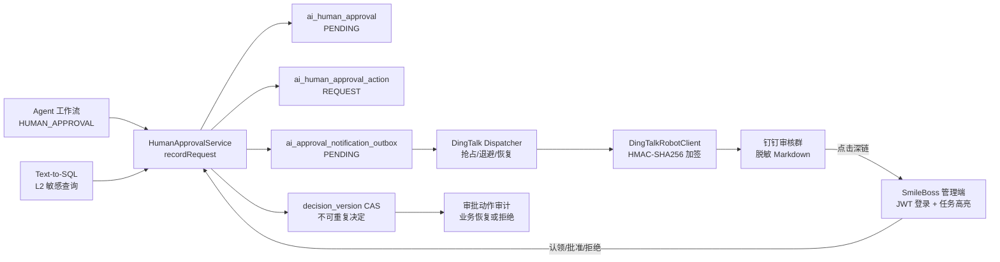

# SmileBoss 人机审核接入钉钉：完整设计、配置与运维手册

> 实现状态：已落地（钉钉自定义机器人通知 + 安全审核深链 + 可靠 Outbox）  
> 参考模式：钉钉自定义机器人 Webhook、加签密钥和关键词配置  
> 适用范围：Agent 工作流人工审核、Text-to-SQL 敏感查询审核，以及未来统一接入 `ai_human_approval` 的审核类型

## 1. 最终结论

本次接入复用了 `dify-test` 的三项配置和签名方式：

```text
DINGTALK_WEBHOOK
DINGTALK_SECRET
DINGTALK_KEYWORD
```

`dify-test` 实际使用的是钉钉“自定义机器人 Webhook”，不是钉钉 OA 审批或互动卡片应用。SmileBoss 因而采用与它兼容、同时更适合招聘敏感数据的安全方案：

1. 创建人工审核任务时，业务数据和通知事件在本地数据库中持久化。
2. 后台投递器异步读取 Outbox，按钉钉规则为 Webhook 加签。
3. 钉钉群只收到脱敏的审核元数据和工作台链接。
4. HR 点击链接进入 SmileBoss 管理端；未登录时先登录。
5. 审批仍由现有 JWT、审核认领租约和 `decision_version` 乐观锁保护。
6. 通知失败会指数退避重试；达到上限后保留失败状态和审计记录。

没有实现“点击钉钉 Markdown 中的同意按钮就直接修改审批结果”。原因不是技术上做不到，而是自定义机器人 Webhook 没有可信的操作者身份回调。用 GET 链接直接变更审批会引入链接转发、预览器误触、重放、CSRF 和无法审计真实审批人的风险。

## 2. STAR 结构化设计说明

### 2.1 S — Situation：场景

SmileBoss 已有统一人工审核表 `ai_human_approval`，但审核人只有打开管理端才能发现新任务。Agent 候选人报告和 L2 敏感 SQL 都可能在 `WAITING_HUMAN` 状态长时间等待。招聘流程又涉及候选人隐私、联系方式和模型上下文，不能把完整载荷直接复制到群聊。

参考项目已经验证了自定义机器人接入方式，并规定了 Webhook、密钥和关键词三个配置项。SmileBoss 需要保持配置习惯一致，同时补齐参考实现没有覆盖的可靠投递、幂等、多实例并发和审批身份安全。

### 2.2 T — Task：目标

目标不是简单调用一次 HTTP，而是建立可运维的人机审核通知通道：

- 两种现有审核来源统一通知；新增审核类型无需重新实现钉钉调用。
- 业务请求不等待外部网络，不因钉钉临时不可用而丢失审批任务。
- 同一审核不重复轰炸群聊。
- 多实例部署时，同一条通知只能由一个实例投递。
- 服务投递中宕机后，消息可以自动恢复。
- 群消息不得泄露简历正文、手机号、邮箱、SQL 原文、提示词或模型上下文。
- 审批动作必须回到有认证、有并发控制、有审计的 SmileBoss 管理端。

### 2.3 A — Action：方案与实现

实现分为六层：

1. `HumanApprovalService.recordRequest`：统一登记 `REQUEST` 审计动作并写通知 Outbox。
2. `ApprovalNotificationOutboxService`：以 `(approval_id, channel, template_code)` 唯一键保证入队幂等。
3. `DingTalkApprovalNotificationDispatcher`：定时扫描、条件更新抢占、投递、重试和恢复僵尸锁。
4. `DingTalkRobotClient`：实现与 `dify-test` 一致的 HMAC-SHA256 加签和 Markdown 请求。
5. `DingTalkApprovalMessageFactory`：只从审核主表选取非敏感元数据，生成管理端深链。
6. 管理端 `App.vue`：识别 `approvalId` 查询参数，直接进入 Agent 审批页并高亮目标任务。

### 2.4 R — Result：结果与验收

- Agent 工作流和 Text-to-SQL 审核都已统一入队。
- 关闭钉钉时不发任何网络请求，但 Outbox 仍保留任务，开启后可以继续投递。
- 开启钉钉但 Webhook 错误时，应用启动失败并明确指出配置问题。
- 已覆盖签名兼容、Webhook 安全校验、消息脱敏、成功投递、失败重试、入队和审批后取消等测试。
- 完整后端测试共 17 个，全部通过。

## 3. 总体架构



关键边界是：钉钉负责“触达”，SmileBoss 负责“授权与决定”。这使群机器人泄漏或链接被转发时，攻击者仍无法绕过系统登录和审批权限。

## 4. 完整执行流程

### 4.1 审批创建

Agent 工作流执行到 `HUMAN_APPROVAL`，或者 Text-to-SQL 风险分类得到 L2 后：

1. 插入 `ai_human_approval`，状态为 `PENDING`。
2. 调用 `HumanApprovalService.recordRequest`。
3. 写 `ai_human_approval_action`，动作类型为 `REQUEST`。
4. 写 `ai_approval_notification_outbox`：
   - `channel=DINGTALK`
   - `template_code=HUMAN_APPROVAL_REQUESTED_V1`
   - `receiver=reviewer_group`
   - `status=PENDING`
   - `payload_json` 只保存 `approvalId`
5. 唯一键拦截重复入队。

业务线程到这里结束，不调用钉钉网络，因而不会被钉钉超时拖慢。

### 4.2 调度、抢占与投递

调度器默认每 5 秒执行：

1. 将超过 `stale-lock-seconds` 的 `SENDING` 记录恢复为 `RETRY`。
2. 查询到期的 `PENDING/RETRY` 记录，单批默认最多 20 条。
3. 对每一条执行条件更新：只有仍处于可投递状态的记录才能进入 `SENDING`。
4. 条件更新成功的实例成为该消息的唯一投递者。
5. 重新读取审批主表；审批已经决定或取消时，将 Outbox 标为 `CANCELLED`。
6. 审批仍待处理时，生成脱敏 Markdown，并调用机器人客户端。
7. 钉钉返回 `errcode=0` 后标记 `SENT`，写 `NOTIFY_DINGTALK_SENT` 审计动作。

这是标准的“至少一次”外部投递：若进程在钉钉已接收、但本地 `SENT` 尚未提交的极小窗口内崩溃，恢复后可能再次发送。自定义机器人没有业务幂等键，无法严格消除此窗口；消息中的固定审批编号可以让审核人识别重复通知，审批 CAS 则保证重复通知绝不会产生两个决定。

### 4.3 钉钉加签

与 `dify-test/devops/ai-agent/dingtalk.py` 相同：

```text
stringToSign = timestamp + "\n" + secret
digest       = HMAC-SHA256(key=secret, data=stringToSign)
sign         = URL_ENCODE(BASE64(digest))
signedUrl    = webhook + "&timestamp=" + timestamp + "&sign=" + sign
```

请求体：

```json
{
  "msgtype": "markdown",
  "markdown": {
    "title": "SmileBoss 人工审核 #42 招聘审核",
    "text": "### [L2] 审核智能问数敏感查询……"
  }
}
```

客户端不记录完整 Webhook；异常信息中的 `access_token` 会被替换为 `***`。

### 4.4 失败与指数退避

第 `n` 次失败后的等待时间：

```text
delay = min(retryBaseSeconds × 2^(n-1), retryMaximumSeconds)
```

默认序列约为 30、60、120、240、480 秒。达到 `max-retries=5` 后进入 `FAILED`，不会无限请求机器人。每次重试或最终失败都会写审批动作审计，但不会在审计载荷中保存 Webhook、密钥或原始敏感数据。

### 4.5 HR 审批

1. HR 在钉钉点击 `DINGTALK_APPROVAL_PAGE_URL?approvalId={id}`。
2. 管理端读取 `approvalId`，切到“Agent 协作平台”，高亮对应任务。
3. 未登录用户必须先登录；深链参数不会丢失。
4. HR 可以先认领任务，认领记录包含租约到期时间。
5. 批准或拒绝时，后端使用 `decision_version` 做 CAS 更新。
6. 只有第一个合法决定成功，后续并发提交会得到“任务已被其他审核人处理”。
7. 未发送的通知会变为 `CANCELLED`；已经发送的消息保留 `SENT` 作为触达证据。

## 5. Outbox 状态机

| 当前状态 | 触发条件 | 下一状态 | 说明 |
|---|---|---|---|
| `PENDING` | 调度器条件更新抢占 | `SENDING` | 设置 `locked_at/locked_by` |
| `RETRY` | 到达 `next_retry_at` 并抢占成功 | `SENDING` | 与首次发送使用同一链路 |
| `SENDING` | 钉钉成功 | `SENT` | 写 `sent_at` 并清锁 |
| `SENDING` | 失败且未超上限 | `RETRY` | 增加 `retry_count`，计算退避时间 |
| `SENDING` | 失败达到上限 | `FAILED` | 保留 `last_error`，等待人工处理 |
| `SENDING` | 审批已不再待处理 | `CANCELLED` | 避免发送过时通知 |
| `SENDING` | 工作进程异常且锁超时 | `RETRY` | 自动恢复，不永久卡死 |
| `PENDING/RETRY/SENDING` | 审批先被处理 | `CANCELLED` | 由审批服务主动取消 |

## 6. 配置说明

| 环境变量 | 默认值 | 必填条件 | 作用 |
|---|---:|---|---|
| `DINGTALK_ENABLED` | `false` | — | 总开关；默认关闭防止误发真实群 |
| `DINGTALK_WEBHOOK` | 空 | 开启时必填 | 自定义机器人完整 Webhook，必须是官方 HTTPS 域名并包含 `access_token` |
| `DINGTALK_SECRET` | 空 | 机器人启用加签时必填 | 钉钉机器人加签密钥 |
| `DINGTALK_KEYWORD` | `招聘审核` | 机器人启用关键词时需要匹配 | 自动附加到标题和正文 |
| `DINGTALK_APPROVAL_PAGE_URL` | `http://localhost:5173` | 开启时非空 | HR 管理端公开可访问地址 |
| `DINGTALK_CONNECT_TIMEOUT_SECONDS` | `5` | 否 | TCP/TLS 建连超时 |
| `DINGTALK_REQUEST_TIMEOUT_SECONDS` | `15` | 否 | 单次请求总超时 |
| `DINGTALK_DISPATCH_INTERVAL_MILLIS` | `5000` | 否 | Outbox 扫描间隔 |
| `DINGTALK_BATCH_SIZE` | `20` | 否 | 单批上限，代码限制最大 100 |
| `DINGTALK_MAX_RETRIES` | `5` | 否 | 最大投递次数 |
| `DINGTALK_RETRY_BASE_SECONDS` | `30` | 否 | 指数退避基数 |
| `DINGTALK_RETRY_MAXIMUM_SECONDS` | `3600` | 否 | 单次最大退避 |
| `DINGTALK_STALE_LOCK_SECONDS` | `120` | 否 | `SENDING` 僵尸锁恢复阈值 |

生产环境 PowerShell 启动示例：

```powershell
$env:DINGTALK_ENABLED = 'true'
$env:DINGTALK_WEBHOOK = 'https://oapi.dingtalk.com/robot/send?access_token=由钉钉生成的令牌'
$env:DINGTALK_SECRET = 'SEC开头的机器人加签密钥'
$env:DINGTALK_KEYWORD = '招聘审核'
$env:DINGTALK_APPROVAL_PAGE_URL = 'https://recruit.example.com'

cd <项目目录>\backend
.\mvnw.cmd -pl smile-app -am spring-boot:run
```

不要把真实 Webhook 或密钥写进 `application.yml`、Git、前端环境变量、日志或钉钉消息正文。建议由容器 Secret、Kubernetes Secret、Vault 或部署平台密钥管理注入。

## 7. 钉钉侧配置步骤

1. 在只包含授权招聘人员的钉钉群中添加“自定义机器人”。
2. 安全设置至少开启“加签”；如同时开启关键词，填写与 `DINGTALK_KEYWORD` 一致的值。
3. 复制 Webhook 和加签密钥到服务端 Secret 管理系统。
4. 设置 `DINGTALK_APPROVAL_PAGE_URL` 为 HR 能访问的 HTTPS 管理端域名。
5. 先在非生产审核群完成连通测试。
6. 创建一条测试工作流审批，观察 Outbox 从 `PENDING` 进入 `SENT`。
7. 点击通知，确认未登录时要求登录，登录后目标审批被高亮。
8. 批准测试任务，确认审批动作、工作流恢复和审计记录完整。

本实现不会自动向真实钉钉群发送“连接测试”消息；只有用户明确创建业务审核任务并开启配置后才会投递，避免配置阶段对外产生意外消息。

## 8. 数据库升级

全新环境执行：

```text
backend/sql/init-mysql.sql
```

已有 HITL/Text-to-SQL 环境执行一次：

```text
backend/sql/migrate-v3-dingtalk-hitl.sql
```

升级增加：

- `last_error`：脱敏后的最后错误。
- `locked_at`：投递抢占时间。
- `locked_by`：投递实例标识。
- `uk_approval_outbox_delivery`：审批、通道、模板联合唯一键。

回滚应用版本前不要直接删除这些列；旧版本会忽略新增列。若确认不再使用钉钉通知，应先停止新版实例并备份 Outbox 和审核动作审计。

## 9. 安全设计与威胁分析

### 9.1 已处理的风险

| 风险 | 控制措施 |
|---|---|
| Webhook 被写入日志 | 客户端不打印 URL；异常对 `access_token` 脱敏 |
| 配置指向恶意服务器 | 开启时只允许钉钉官方 HTTPS 机器人域名 |
| 群聊泄露候选人隐私 | 消息工厂不读取 `request_payload_json`，只展示元数据 |
| 重复通知 | 数据库联合唯一键 + Outbox 状态机 |
| 多实例重复投递 | `UPDATE ... WHERE status IN (...)` 原子抢占 |
| 外部投递成功后本地提交前宕机 | 接受极小概率重复触达；固定审批编号识别，审批 CAS 防重复决定 |
| 进程在投递中宕机 | 超时恢复 `SENDING` 为 `RETRY` |
| 通知到达时审批已完成 | 投递前检查审批状态；审批时主动取消未发消息 |
| 链接转发导致越权 | 深链不含凭证，所有 API 仍要求 JWT |
| 并发审批覆盖 | `decision_version` CAS，只允许一个最终决定 |
| GET/预览器误触审批 | 深链只打开页面，不执行批准或拒绝 |

### 9.2 仍需在部署层落实

- 钉钉群成员必须按最小权限维护，离职或转岗人员及时移除。
- 管理端生产地址必须使用 HTTPS，并配置企业 SSO、MFA 或至少强密码策略。
- `HR_ADMIN`、`DATA_REVIEWER` 应进一步映射到真正的 RBAC 权限；当前演示系统主要依赖登录身份和业务校验。
- 对 `FAILED` Outbox 建立监控告警，避免通知长期失败无人发现。
- 定期轮换机器人密钥；轮换期间旧的失败消息可以用新密钥重试。

## 10. 为什么当前不做钉钉内“一键同意/拒绝”

自定义机器人 Markdown 只能发送链接，不会返回经过企业身份认证的按钮点击事件。若把批准链接写成带 token 的 GET 请求，会产生以下问题：

- 钉钉或安全网关的链接预览可能自动访问 URL，造成误审批。
- 链接被转发后，系统不能证明是谁作出决定。
- token 容易进入浏览器历史、代理日志和截图。
- 很难同时正确解决重放、撤回、人员离职、权限变化和多审批人规则。

因此当前设计刻意让钉钉只做可靠触达。若业务明确要求在钉钉卡片内审批，应升级为“企业内部应用 + 互动卡片回调”或“钉钉 OA 审批”，而不是扩展自定义机器人链接。

## 11. 互动卡片/OA 审批升级路线

升级需要新增但不能与 Webhook 密钥混用的配置：

```text
DINGTALK_APP_KEY
DINGTALK_APP_SECRET
DINGTALK_AGENT_ID
DINGTALK_CALLBACK_TOKEN
DINGTALK_CALLBACK_AES_KEY
```

推荐新增的领域对象：

- `ai_dingtalk_user_binding`：钉钉用户 ID 到 SmileBoss 用户 ID 的有效期绑定。
- `ai_dingtalk_callback_event`：以钉钉事件 ID 去重，保存验签结果和处理状态。
- `external_instance_id`：审批任务与钉钉卡片/OA 实例关联。

回调处理顺序必须是：读取原始请求体 → 验签/解密 → 校验时间窗 → 事件 ID 幂等 → 查用户绑定与角色 → 读取审批版本 → CAS 决定 → 写审计 → 返回钉钉成功应答。回调不能使用固定的系统管理员用户代替真实操作者。

## 12. 代码定位

| 文件 | 职责 |
|---|---|
| `DingTalkProperties.java` | 配置绑定、官方域名校验、审核深链 |
| `DingTalkConfigurationValidator.java` | 启动期 fail-fast |
| `DingTalkRobotClient.java` | 加签、HTTP 请求、钉钉业务响应校验、秘密脱敏 |
| `DingTalkApprovalMessageFactory.java` | 招聘隐私安全的 Markdown 模板 |
| `DingTalkApprovalNotificationDispatcher.java` | 抢占、投递、退避、宕机恢复、审计 |
| `ApprovalNotificationOutboxService.java` | 可靠入队、去重、审批后取消 |
| `HumanApprovalService.java` | 统一审批请求入口和最终决定 |
| `frontend/admin/src/App.vue` | 钉钉深链解析和目标任务高亮 |
| `schema.sql` / `init-mysql.sql` | H2/MySQL 最新表结构 |
| `migrate-v3-dingtalk-hitl.sql` | 已有 MySQL 环境升级 |

## 13. 验证与排障

常用只读查询：

```sql
SELECT id, approval_id, status, retry_count, next_retry_at, last_error, sent_at
FROM ai_approval_notification_outbox
ORDER BY id DESC;

SELECT approval_id, action_type, actor_id, payload_json, created_at
FROM ai_human_approval_action
WHERE approval_id = ?
ORDER BY id;
```

典型问题：

- 启动提示 Webhook 必须 HTTPS：检查是否误填了测试地址或反向代理地址。
- 启动提示缺少 `access_token`：必须复制完整机器人 Webhook。
- 钉钉报关键词不匹配：确保机器人安全设置和 `DINGTALK_KEYWORD` 完全一致。
- Outbox 长期 `PENDING`：检查 `DINGTALK_ENABLED` 是否为 `true`、调度是否启用。
- Outbox 为 `RETRY`：看脱敏后的 `last_error`，检查网络、机器人是否被停用、密钥是否轮换。
- Outbox 为 `FAILED`：修复配置后由运维审核失败原因，再将指定记录恢复为 `RETRY`；不要批量重置全部历史消息。
- 深链打开后找不到任务：任务可能已由其他 HR 处理；查看审核动作表确认最终决定。

运行验证：

```powershell
cd <项目目录>\backend
.\mvnw.cmd -pl smile-app -am test
.\mvnw.cmd -pl smile-app -am package -DskipTests

cd <项目目录>\frontend\admin
npm.cmd run build
```
