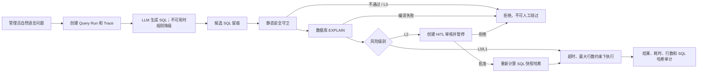

# SmileBoss 智能问数与人机审核实现说明

## 1. 已实现范围

这一版提供一条可运行、可追溯的招聘域 Text-to-SQL 链路。模型和数据库沿用 SmileBoss 当前配置：聊天模型通过现有 `LlmGateway` 路由 Claude、Qwen、DeepSeek、Kimi；业务库沿用 Spring `DataSource`，开发环境为 H2 MySQL 模式，`mysql` Profile 使用项目现有 MySQL 配置。

核心目标不是“让模型写 SQL”，而是“让不可信 SQL 在确定性策略约束下变成可审核的数据操作”。因此模型只负责候选生成，执行权限始终由代码、数据库授权和人工审核共同控制。

## 2. 端到端执行流程



具体阶段：

1. `POST /api/text-to-sql/queries` 创建 `ai_sql_query_run`，分配独立 `trace_id`。
2. 启用模型时调用现有 `LlmGateway`，要求只输出结构化 JSON；模型未启用、调用失败或输出非法时，使用招聘域规则模板降级。
3. 每个候选写入 `ai_sql_candidate`，不会直接覆盖或丢弃原始生成结果。
4. `SqlSafetyGuard` 删除注释、屏蔽字符串字面量后再分词，避免把字符串里的关键字误判为指令，也避免注释绕过。
5. 只允许单条 `SELECT`/`WITH`；禁止 DML、DDL、过程调用、服务器文件读取、锁查询和危险延时函数。
6. 提取 `FROM`、`JOIN` 和逗号连接的数据表；任何不在招聘语义模型白名单中的表都会被拒绝。
7. 没有 `LIMIT` 时自动追加，最大值为 1000；JDBC 再设置 `setMaxRows(maxRows + 1)` 和 15 秒查询超时，形成双重保护。
8. 数据库执行 `EXPLAIN`，语法、字段或关系错误会在读取业务数据前失败。
9. L0/L1 直接执行；命中姓名、电话、邮箱、简历原文、面试回答等字段时提升到 L2。
10. L2 会创建一个强状态审核运行、审核任务和 `ai_human_approval`，原查询状态变为 `WAITING_HUMAN`。
11. 人工批准前重新校验 `input_snapshot_hash`，并以 `decision_version` 做乐观并发控制，避免旧页面重复批准或 SQL 被替换。
12. 结果写入 `ai_sql_execution`，保存字段、行数据、耗时、截断标志和 SQL 哈希；反馈写入 `ai_sql_feedback`。

## 3. 风险模型

| 级别 | 示例 | 执行策略 |
|---|---|---|
| L0 | 职位数、候选人数、按城市聚合 | 校验和 EXPLAIN 通过后自动执行 |
| L1 | 非敏感业务明细、多表普通分析 | 自动执行，但受超时和最大行数限制 |
| L2 | 姓名、电话、邮箱、简历原文、面试原回答 | 必须人工审核；批准后校验快照再执行 |
| L3 | 写操作、未知表、堆叠 SQL、危险函数、导出文件 | 直接拒绝，不提供“人工强制放行”入口 |

L3 不允许人工绕过很重要。人工审核用于确认敏感数据的业务必要性，不用于替代 SQL 安全边界。

## 4. 人工审核实现

`ai_human_approval` 在原有工作流审批基础上增加：

- `approval_type/origin_type/origin_id`：统一承载工作流和智能问数审核。
- `policy_code/policy_version/risk_level`：记录当时实际命中的策略版本。
- `reviewer_group/assigned_to/claimed_at/lease_expires_at`：支持审核池、认领和租约。
- `due_at/expires_at/timeout_action`：支持 SLA、到期拒绝或升级。
- `request_payload_json/decision_payload_json`：保留审核上下文和结构化决定。
- `input_snapshot_hash`：保证“审核看到的内容”和“批准后执行的内容”一致。
- `decision_version`：乐观锁，防止两位审核人同时提交。

`ai_human_approval_action` 追加记录 `REQUEST`、`CLAIM`、`DECIDE`，用于完整审计。`ai_approval_notification_outbox` 已预留可靠通知的 Outbox 表，后续可连接钉钉、邮件或站内信消费者。

## 5. 语义层与数据表

- `ai_data_source`：逻辑数据源及只读标记。当前 `RECRUITMENT_MAIN` 指向 Spring DataSource。
- `ai_semantic_model`：招聘域表、关系和治理规则。
- `ai_metric_definition`：指标表达式、维度、过滤条件和敏感级别。
- `ai_sql_example`：高质量自然语言—SQL 样例，为后续 RAG 检索提供语料。
- `ai_sql_query_run`：一次问题的主状态和最终 SQL。
- `ai_sql_candidate`：模型或规则产生的候选 SQL。
- `ai_sql_validation`：每个验证器的独立结果。
- `ai_sql_execution`：执行结果和性能审计。
- `ai_sql_feedback`：评分、修正 SQL 和评论。

当前代码允许的业务表为：`recruit_job`、`talent_candidate`、`talent_resume`、`recruit_recommendation`、`mock_interview_session`、`ai_interview_invitation`、`ai_interview_session`、`candidate_activity_event`。

## 6. API 使用

生成并尝试执行：

```http
POST /api/text-to-sql/queries
Authorization: Bearer <admin-token>
Content-Type: application/json

{
  "question": "每个城市有多少候选人？",
  "execute": true,
  "maxRows": 100
}
```

敏感问题会返回 `WAITING_HUMAN`：

```json
{
  "question": "列出候选人的电话和邮箱",
  "execute": true
}
```

批准或拒绝：

```http
POST /api/text-to-sql/queries/{queryRunId}/decisions
Content-Type: application/json

{
  "decision": "APPROVE",
  "comment": "已确认用于本次候选人邀约"
}
```

审核任务也会出现在 `GET /api/agent-platform/human-tasks`。认领接口为 `POST /api/agent-platform/human-tasks/{approvalId}/claim`，请求体可传 `{"leaseMinutes":30}`。

## 7. 环境和迁移

- H2 开发/测试：应用启动时读取 `schema.sql` 和 `data.sql`，无需额外操作。
- 全新 MySQL：执行 `backend/sql/init-mysql.sql`。
- 早期 MySQL 数据库：先执行一次 `backend/sql/migrate-v2-hitl-text-to-sql.sql`，再执行最新版 `init-mysql.sql` 创建新增表和基础策略。

生产环境仍应给 Text-to-SQL 配置独立的数据库只读账号，并在数据库层只授予批准的视图 `SELECT` 权限。当前第一版为了完全沿用项目的数据库配置，共用 Spring DataSource；应用层已经只调用 JDBC 查询接口并设置 SQL 守卫，但数据库最小权限仍是上线前必做项。

## 8. 当前边界与下一步

当前版本是可运行 MVP，已经完整覆盖生成、验证、人工暂停、恢复执行和审计。下一阶段建议按顺序加入：

1. 用只读副本/只读账号替换共享业务连接，并将可查询对象收敛为脱敏视图。
2. 根据数据库统计信息加入扫描行数、成本阈值和租户级并发配额。
3. 将 `ai_sql_example`、指标定义、字段描述向量化，做 Schema/Metric/Example 三路 RAG。
4. 候选生成从单 SQL 扩展为多候选，使用静态得分、EXPLAIN 成本和示例相似度排序。
5. 增加审核超时扫描器和 Outbox 消费者，实现超时拒绝/升级与可靠通知。
6. 结果缓存只保存聚合数据；敏感明细禁止共享缓存，并根据审批用途设置短 TTL。
